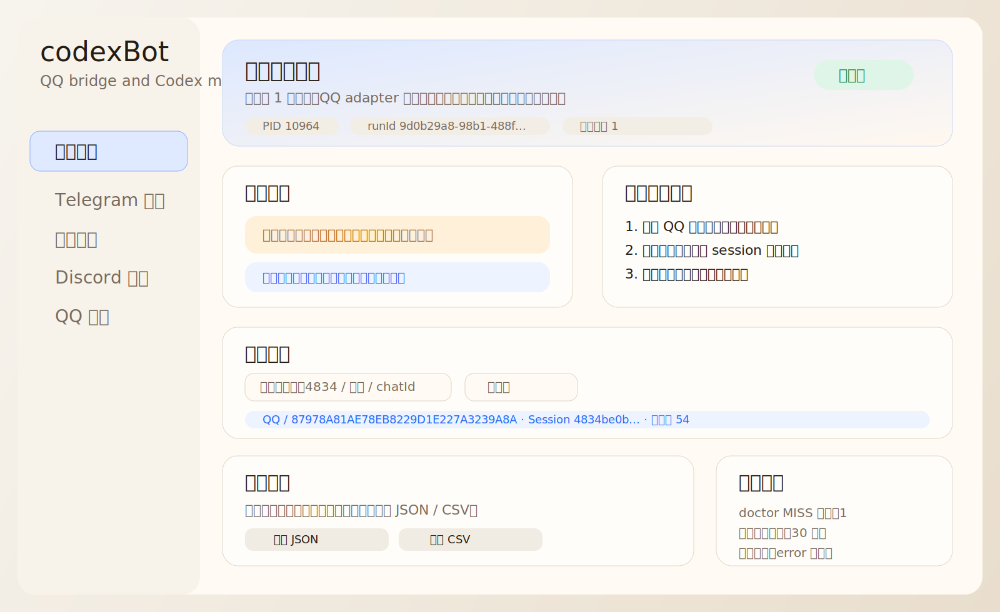
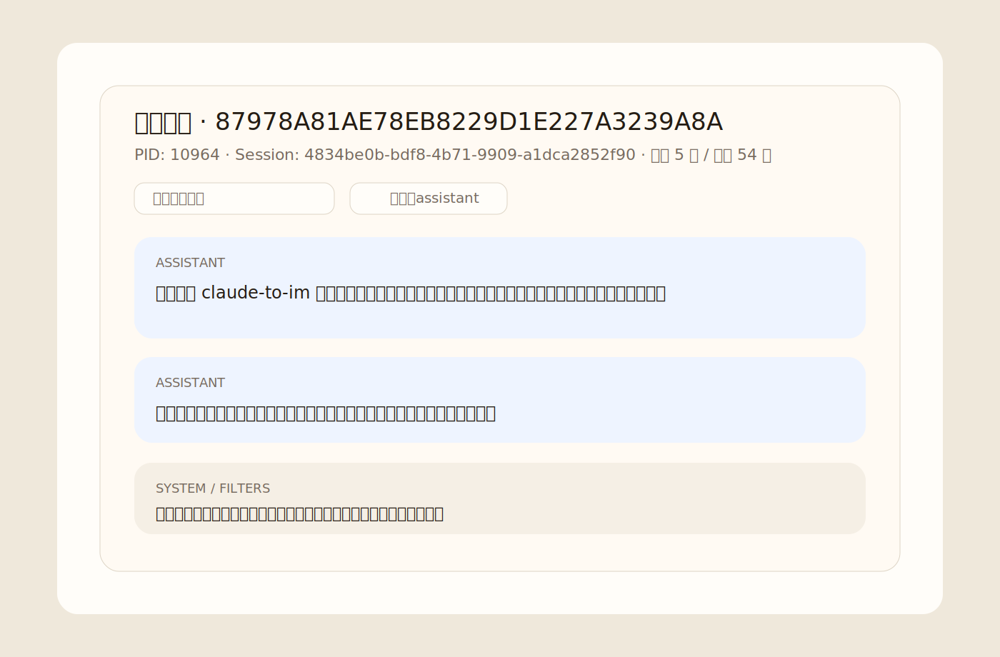

# codexBot

codexBot is a safe local bot bridge and management tool for IM + Codex workflows.

一个面向 `Claude-to-IM` / `Codex` 的桥接与监控项目，当前以 `QQ 私聊桥接 + Web 控制台` 为核心。

## 特性

- QQ / Telegram / 飞书 / Discord 渠道配置
- 本地 Web 控制台
- bridge 启动 / 停止 / 重启 / doctor / logs
- SSE 实时日志流
- 会话绑定管理
- 对话中心与消息详情弹窗
- 消息搜索 / 角色过滤 / 审计导出
- 一键诊断修复与 stale PID 修复
- 运行告警、建议模板、阈值设置

## 预览

### 控制台总览



### 对话详情



## 项目结构

- `scripts/`：启动、检查、配置脚本
- `ui-console/`：Web 控制台
- `vendor/Claude-to-IM-skill/`：桥接核心依赖
- `config/`：本地配置模板
- `.env.example`：环境变量样例
- `INSTALL.md`：安装与启动指南

## 环境要求

- Windows PowerShell
- Node.js
- npm
- Git
- Codex CLI

## 快速开始

1. 检查环境

```powershell
powershell -ExecutionPolicy Bypass -File .\scripts\check-env.ps1
```

2. 准备 bridge 配置

- 参考 `.env.example`
- 真实运行配置位于 `C:\Users\Administrator\.claude-to-im\config.env`

3. 启动 Web 控制台

```powershell
powershell -ExecutionPolicy Bypass -File .\scripts\ui-console.ps1
```

4. 打开控制台

- `http://127.0.0.1:3210`

## 常用命令

```powershell
powershell -ExecutionPolicy Bypass -File .\scripts\bridge-control.ps1 status
powershell -ExecutionPolicy Bypass -File .\scripts\bridge-control.ps1 start
powershell -ExecutionPolicy Bypass -File .\scripts\bridge-control.ps1 stop
powershell -ExecutionPolicy Bypass -File .\scripts\bridge-control.ps1 logs 80
powershell -ExecutionPolicy Bypass -File .\scripts\bridge-control.ps1 doctor
```

## 发布内容

- Web 项目目录：`codexBot/`
- ZIP 包：`F:\QBot01\releases\codexBot-web-20260313.zip`
- Git bundle：`F:\QBot01\releases\codexBot-main.bundle`

## 说明

- `bridge-control.ps1` 优先使用仓库内 `vendor\Claude-to-IM-skill`，找不到时再回退到已安装 skill
- 控制台运行依赖本机 `node`
- 真实运行配置和日志仍位于 `C:\Users\Administrator\.claude-to-im`
- 本仓库不包含任何生产密钥或用户数据
